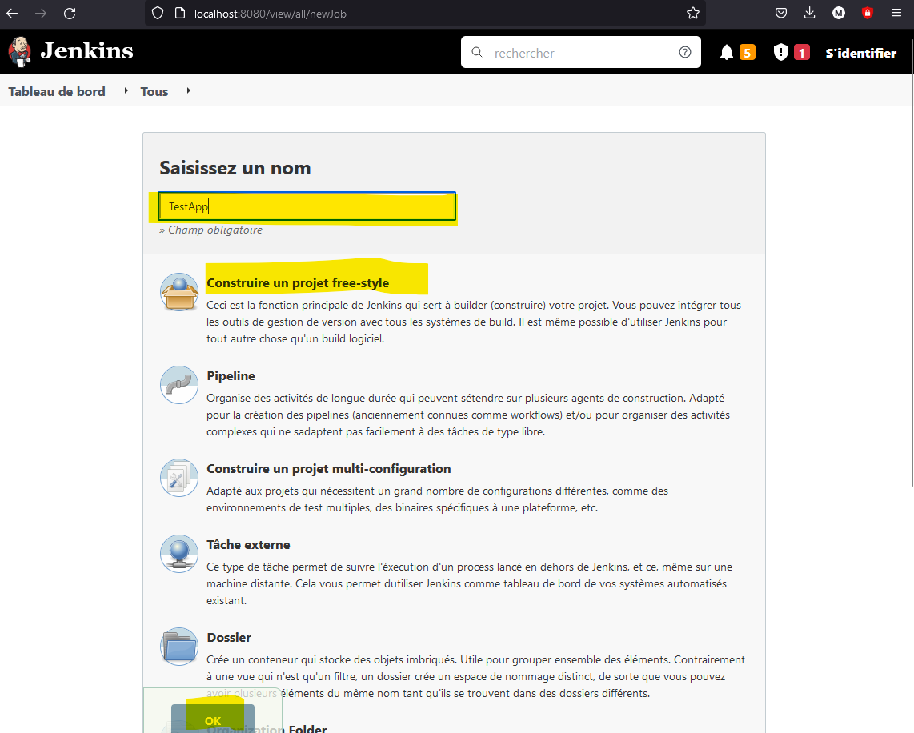
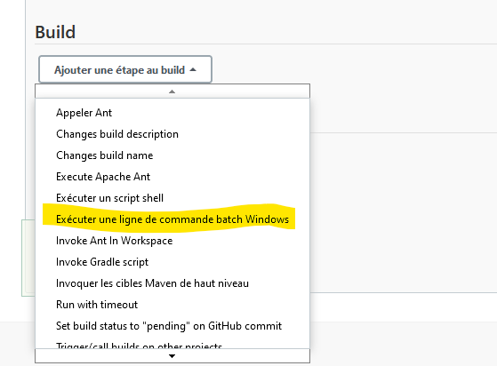
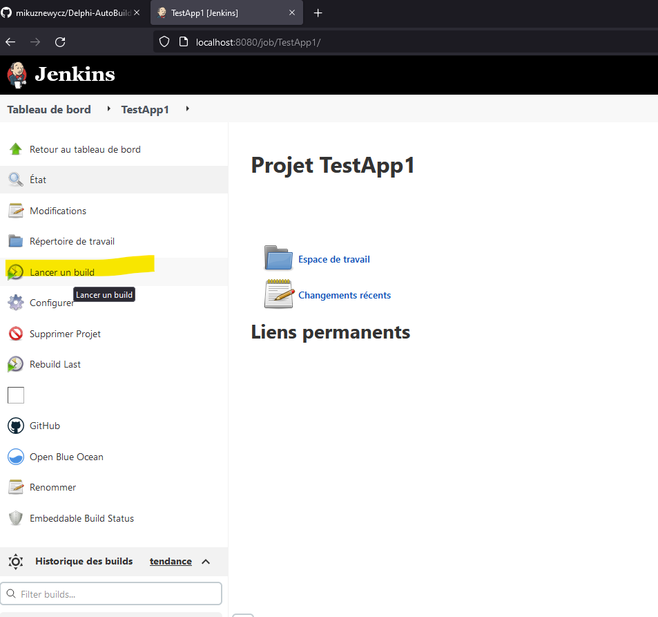
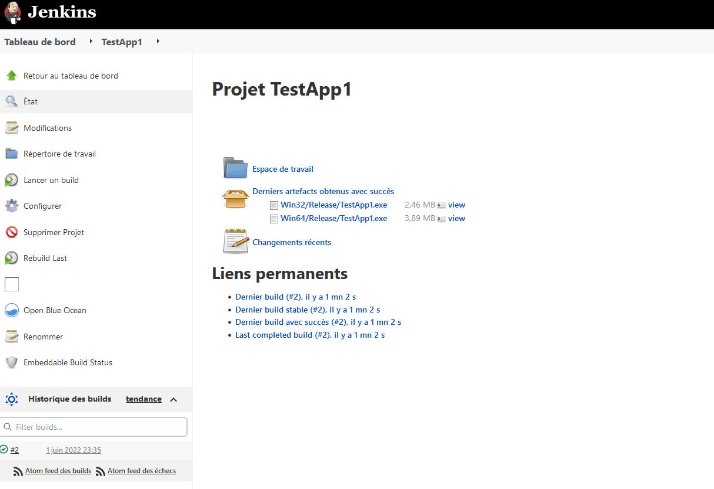

# Delphi-AutoBuild
Fichier bat pour construire des projets Delphi sans ouvrir l'IDE (cmd ou powershell), ou avec des outils de CI/CD (jenkins par exemple).

[Delphi](https://www.embarcadero.com/fr/products/delphi/ "Page d'accueil d'Eurekalog")

[Eurekalog](https://www.eurekalog.com/ "Page d'accueil d'Eurekalog")

[Aspack Win32 EXE file packing](http://www.aspack.com/aspack.html/ "Aspack Home Page")

[Jenkins](https://www.jenkins.io/ "Page d'accueil de Jenkins")

# Configuration 

1 - Définissez la variable rsvars avec le chemin de votre version de Delphi.
   
   Pour Delphi 10.4 
> set rsvars="C:\Program Files (x86)\Embarcadero\Studio\21.0\bin\rsvars.bat"
   
2 - si vous utilisez Eurekalog, vous pouvez définir le chemin "eurekalog" dans le fichier batch.

> set Eurekalog="C:\Program Files (x86)\Neos Eureka S.r.l\EurekaLog 7\Packages\Studio23\ecc32.exe" 	

3 - Si vous utilisez Aspack pour compresser les exécutables, vous pouvez définir le chemin "aspack" dans le fichier batch.

> set Aspack="C:\Program Files (x86)\Aspack\Aspack.exe"
   
# Comment l'utiliser

> .\AutoBuild.bat [options] "AppName"

## Options

Afficher l'aide
> /?, --help                    

Afficher la version
> /v, --version                 

Utilser Aspack pour compresser l'executable
> /a, --aspack                  

Choisir la configuration (Release, Debug, ...)
> --config=Config                 

Choisir la plate-forme (Win32, Win64, ...)
> --platform=Platform             

## Via cmd ou powershell  

Pour compiler notre application test en Debug / Win32
> .\AutoBuild.bat --config=Debug --platform=Win32 TestApp1

Pour compiler notre application test en Release / Win64
> .\AutoBuild.bat --config=Release --platform=Win64 TestApp1

## Via un job jenkins 

Créer un nouveau job **Freestyle** dans Jenkins 

Dans la partie **Gestion de code source**, sélectionner **Git**, et sélectionner/enregistrer vos identifiants dans **Credentials**

Ensuite **ajouter une étape au build** en choisissant **Executer une ligne de commande batch windows**

Renseigner **la/les commande(s) à éxécuter**

(Optionnel) Ajouter une **action à la suite du build** pour **archiver les artefacts**  (fichiers exécutables compilés à la suite du build)

Après avoir sauvergarder la configuration du job, **lancer un build** 

Et voilà ! ;-) le projet a été compilé sans ouvrir Delphi.

Si besoin, il est possible d'ajouter d'autres étapes au job pour :
- envoyer des mails ,
- manipuler les fichiers ,
- déployer les fichiers sur certains serveurs,
- ect... à vous de faire travailler votre imagination

Enjoy